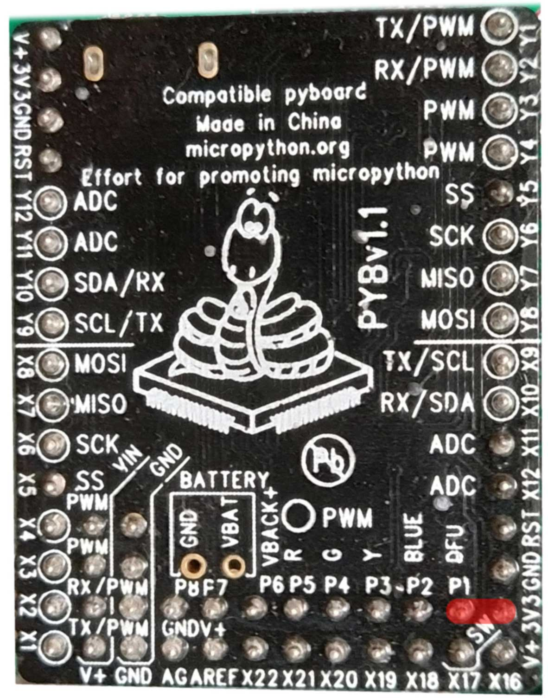
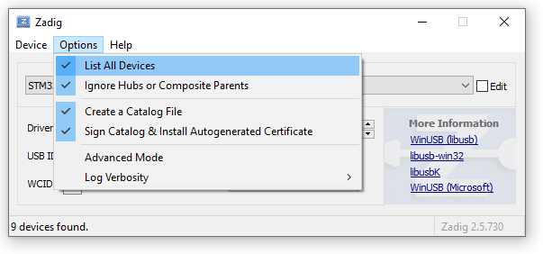
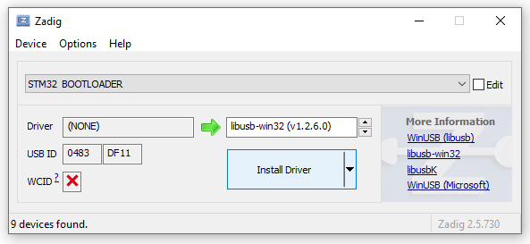
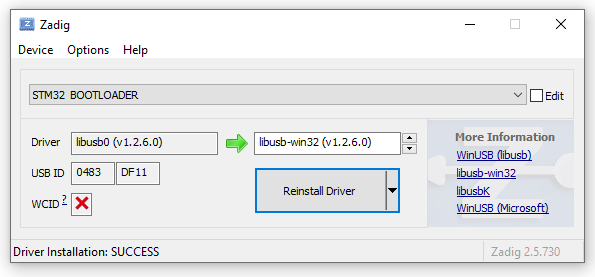
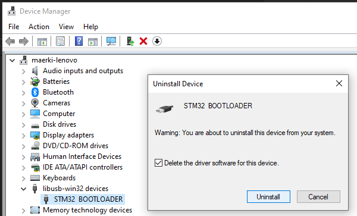

# Firmware update on the pyboard

There are many ways and tools for updating pyboards.
mpfshell2 simplify firmware updates for pyboards on windows.

## Update firmware

* Bring pyboard in DFU Mode
* Call `pyboard_update.exe`
* Optionally: Install USB driver for `STM32 BOOTLOADER`
* Optionally: Filesystem Factory Reset

## FAQ: Bring pyboard in DFU-mode (Device Firmware Update)

* Disconnect USB.
* Connect the DFU pin with the 3.3V pin (they're right next to each other).
* Connect the pyboard to your computer via USB. The red, orange and red LED glow lowly.



## FAQ: Install USB driver for `STM32 BOOTLOADER`

Download and double click [Zadig](https://github.com/pbatard/libwdi/releases/download/b730/zadig-2.5.exe).

Make sure these options are checked:



Now select `STM32 BOOTLOADER` and `libusb-win32` and click `Install Driver`.
`Zadig` will freeze for a moment and then install the driver.

DANGER: Make sure you select `STM32 BOOTLOADER`!!!



After everything went well, the Driver will become `libusb0` as in this image:


## FAQ: Uninstall the driver for `STM32 BOOTLOADER`

If for some reason you want to uninstall the driver:
* Connect the pyboard in DFU mode
* open the Device Manager, find the device
* uninstall the driver as follows:



## FAQ: Filesytem Factory Reset

See: [Filesytem Factory Reset](https://docs.micropython.org/en/latest/pyboard/tutorial/reset.html#factory-reset-the-filesystem)

## FAQ: `pyboard_update.exe` - Missing device driver

```
ERROR: Driver not installed. Please follow 'Install USB driver for STM32 BOOTLOADER' on https://github.com/hmaerki/mpfshell2/blob/master/readme_firmware_update.md
```

## FAQ: `pyboard_update.exe` - Pyboard not in DFU Mode

```
ERROR: No pyboards in DFU mode found. Please follow 'Bring pyboard in DFU-mode' on https://github.com/hmaerki/mpfshell2/blob/master/readme_firmware_update.md
```


## FAQ: `pyboard_update.exe` - Successful update

This is the console output of a successful update:

```
$ pyboard_update.exe
Firmwares available:
  [0] pybv11-20210202-v1.14.dfu
  [1] pybv11-20190125-v1.10.dfu
Which firmware do you want to program? 0
File: c:\users\maerki\appdata\local\programs\python\python37-32\lib\site-packages\mp\firmware\pybv11-20210202-v1.14.dfu
    b'DfuSe' v1, image size: 360941, targets: 1
    b'Target' 0, alt setting: 0, name: "ST...", size: 360656, elements: 2
      0, address: 0x08000000, size: 14792
      1, address: 0x08020000, size: 345848
    usb: 0483:df11, device: 0x0000, dfu: 0x011a, b'UFD', 16, 0x3b3aab62
Writing memory...
0x08000000   14792 [=========================] 100% 
0x08020000  345848 [=========================] 100% 
Successfully wrote pybv11-20210202-v1.14.dfu
```
Now connect to the poard and verify the version:

```
$ pyboard
Found COM9
Connected to pyboard
Directory "micropython" does not exist and will not be replicated!
>
MicroPython v1.14 on 2021-02-02; PYBv1.1 with STM32F405RG
Type "help()" for more information.
>>>
*** Exit REPL with Ctrl+Q ***
Start 'main.py' (by sending <ctrl-D>)

MPY: sync filesystems
MPY: soft reboot
MicroPython v1.14 on 2021-02-02; PYBv1.1 with STM32F405RG
Type "help()" for more information.
>>>
```

## Implementation of the firmware update

This software is based on:
* [`Zadig` USB devide driver](https://zadig.akeo.ie/)
* [Software to program the firmware](https://github.com/micropython/micropython/blob/master/tools/pydfu.py)
